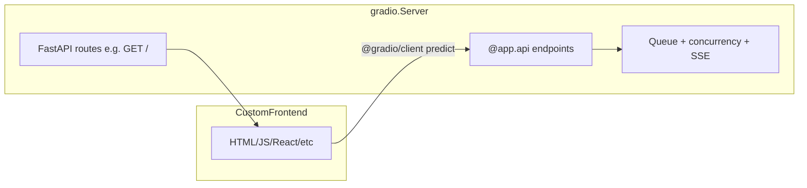

# Gradio Server — Agent Reference

## Agent orientation

- Use this doc when **evaluating or implementing** a Gradio backend with a custom frontend.
- This is **not a migration mandate**. Eyas currently uses `gr.Blocks`; Server is one option when a custom UI is needed.
- Primary sources:
  - [Introducing gradio.Server (HF blog)](https://huggingface.co/blog/introducing-gradio-server)
  - [gradio.Server API reference](https://www.gradio.app/docs/gradio/server)
  - [Server mode guide](https://www.gradio.app/guides/server-mode/)

---

## What `gradio.Server` is

`gradio.Server` is a **FastAPI application** with Gradio's API engine built in.

- Standard FastAPI features work directly: `@app.get()`, `@app.post()`, middleware, routers, dependency injection, etc.
- `@app.api()` registers endpoints that go through Gradio's **queue, concurrency control, and SSE streaming**.
- `@app.launch()` starts the server and registers deferred API endpoints.

That combination matters for ML workloads: a plain FastAPI route does not get Gradio's queue. Two concurrent GPU requests can collide. `@app.api()` handles that.



---

## When to use Server vs Blocks

Evaluate the fit; do not assume migration is required.

| Situation | Reasonable direction |
|-----------|---------------------|
| Gradio components + theme/CSS are enough | Stay on `gr.Blocks` |
| Full custom UI (canvas, drag-drop, SPA) | Consider `gradio.Server` |
| Need custom REST routes + Gradio queue | Consider `gradio.Server` |
| HF Space / ZeroGPU / `gradio_client` access | Both work; Server exposes `@app.api()` to clients |
| Hackathon "Off-Brand" bonus | Custom frontend via Server is one valid path |

**Use `gr.Blocks`** when Gradio's built-in UI components (`gr.Video`, `gr.Chatbot`, themes, etc.) are sufficient.

**Use `gradio.Server`** when you want your own frontend (HTML/JS, React, Svelte, etc.) while keeping Gradio's backend: queuing, streaming, Spaces hosting, and client compatibility.

---

## Core usage patterns

### Minimal backend

```python
from gradio import Server
from fastapi.responses import HTMLResponse

app = Server()

@app.api(name="hello")
def hello(name: str) -> str:
    return f"Hello, {name}"

@app.get("/", response_class=HTMLResponse)
async def homepage():
    return "<html><body><h1>Hello</h1></body></html>"

if __name__ == "__main__":
    app.launch()
```

Running this gives you:

- A Gradio API endpoint at `/gradio_api/call/hello` (queued, SSE-capable)
- Auto-generated API info at `/gradio_api/info`
- Callable via `gradio_client` and `@gradio/client` by name

### `@app.api()` vs plain FastAPI routes

| | `@app.api()` | `@app.post()` / `@app.get()` |
|--|--------------|------------------------------|
| Queue | Yes | No |
| Concurrency control | Yes (`concurrency_limit`, etc.) | Manual |
| SSE streaming from generators | Yes (`yield`) | Manual |
| `gradio_client` compatible | Yes | No |
| Use for | ML inference, long-running work | Static pages, health checks, custom REST |

Custom FastAPI routes take priority over Gradio defaults. For example, `@app.get("/")` replaces Gradio's default UI page.

### Python client

```python
from gradio_client import Client

client = Client("http://localhost:7860")
result = client.predict("World", api_name="/hello")
print(result)  # "Hello, World!"
```

### JavaScript client (browser)

Prefer `@gradio/client` over raw `fetch()` so requests go through Gradio's queue. This also matters on ZeroGPU Spaces, where the JS client forwards iframe auth headers.

```javascript
import { Client, handle_file } from "https://cdn.jsdelivr.net/npm/@gradio/client/dist/index.min.js";

const client = await Client.connect(window.location.origin);
const result = await client.predict("/remove_background", {
    image_path: handle_file(file),
});
// result.data[0].url for returned files
```

### File uploads and returns

Use `FileData` for file paths in API signatures:

```python
from gradio import Server
from gradio.data_classes import FileData
from PIL import Image

app = Server()

@app.api(name="process_image")
def process_image(image_path: FileData) -> FileData:
    im = Image.open(image_path["path"])
    # ... process ...
    out_path = image_path["path"].rsplit(".", 1)[0] + "_out.png"
    im.save(out_path)
    return FileData(path=out_path)
```

### Streaming

Generator functions stream via SSE automatically:

```python
@app.api(name="generate", concurrency_limit=1, stream_every=0.5)
def generate(prompt: str):
    for token in model.generate(prompt):
        yield token
```

### Concurrency

`@app.api()` accepts the same concurrency options as `gr.api()`:

- `concurrency_limit` — max concurrent calls (default is conservative; often `1` for GPU work)
- `concurrency_id` — share a limit across endpoints
- `queue` — enable/disable queuing (default `True`)

Set `concurrency_limit` based on what the workload can handle. Increase or set to `None` for external API calls that scale horizontally.

### MCP tools (optional)

Stack `@app.mcp.tool()` with `@app.api()` to expose endpoints as MCP tools:

```python
@app.mcp.tool(name="add")
@app.api(name="add")
def add(a: int, b: int) -> int:
    """Add two numbers together."""
    return a + b

app.launch(mcp_server=True)
```

Install MCP support: `pip install "gradio[mcp]"`

The decorators are independent — an endpoint can be API-only, MCP-only, or both.

### ZeroGPU on Spaces

For GPU-backed functions on Hugging Face Spaces with ZeroGPU:

- Decorate the backend function with `@spaces.GPU`
- Call the endpoint from the browser via `@gradio/client` (not raw fetch)

See the [HF blog example](https://huggingface.co/blog/introducing-gradio-server) for a full pattern.

---

## Agent actionables

These are **decision prompts**, not a required sequence.

### Assess UI fit

Does the feature need a UI that Gradio components cannot express (custom canvas, complex drag-and-drop, multi-page SPA)? If not, `gr.Blocks` may be simpler.

### Separate logic from presentation

Before wiring `@app.api()`, extract callable functions from UI callbacks. Keep business logic framework-agnostic where possible so it can serve Blocks callbacks today and API endpoints later.

### Choose a frontend approach

Options include vanilla HTML/JS, a framework SPA, or a hybrid. No prescribed stack. Static assets can be served via `@app.get("/")` or FastAPI static file mounting.

### Choose an integration strategy

| Strategy | Tradeoff |
|----------|----------|
| Greenfield `Server` app | Clean separation; rewrite presentation layer |
| Server alongside existing Blocks | Two entry points; gradual adoption |
| `mount_gradio_app()` on a FastAPI app | Keep Blocks UI, add custom routes alongside |

Evaluate which fits the task. None is mandated for Eyas.

### Verify Gradio version

`Server` requires a recent Gradio release. This repo pins `gradio` loosely in `eyas/requirements.txt`. Check the installed version against the [Server docs](https://www.gradio.app/docs/gradio/server) before implementing.

### Test via clients first

Validate `@app.api()` endpoints with `gradio_client` (Python) and/or `@gradio/client` (JS) before building the full frontend. Faster iteration, confirms queue and types work.

### Set concurrency appropriately

GPU-bound endpoints: start with `concurrency_limit=1`. External or CPU-only work: consider higher limits or `None`.

---

## Eyas context (optional)

Factual pointers for work in this repo. No migration plan implied.

### Current state

- Eyas runs `gr.Blocks` via `eyas/app.py` → `build_app()` in `eyas/ui/gradio_app.py` → `app.launch()`.
- UI customization is heavy but in-Python: `EyasTheme`, CSS strings, `gr.HTML`, inline JS snippets.
- No separate frontend assets (no standalone `.html`/`.js`/`.css` files).

### Relationship to Server

- Server would be a **greenfield path** for a fully custom frontend, not a drop-in replacement for existing Blocks wiring.
- Callback logic inside `build_app()` would need to become standalone functions before `@app.api()` registration.
- The current Blocks UI already qualifies as heavily customized Gradio. Server is relevant if you want to leave Gradio's component model entirely.

### Hackathon note

The Off-Brand bonus mentions custom frontend / `gr.Server`. Server is one way to achieve that; it is not the only way.

### Files to read before Server work

| File | Why |
|------|-----|
| `eyas/ui/gradio_app.py` | Current UI layout, callbacks, business logic |
| `eyas/app.py` | Launch entry point, preferences |
| `eyas/ui/README.md` | Tab structure, i18n, run commands |
| `docs/ARCHITECTURE.md` §6 | Intended UI responsibilities |

---

## References

- [Introducing gradio.Server (HF blog)](https://huggingface.co/blog/introducing-gradio-server)
- [gradio.Server API reference](https://www.gradio.app/docs/gradio/server)
- [Server mode guide](https://www.gradio.app/guides/server-mode/)
- [Example Space: gradio/server_app](https://huggingface.co/spaces/gradio/server_app)
- [Blog demo: ysharma/text-behind-image](https://huggingface.co/spaces/ysharma/text-behind-image)
